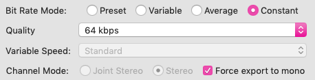

# Scription ✍️

Scription is an editor for automated transcription services like [Amazon Transcribe](https://aws.amazon.com/transcribe/) and [Mozilla Deepspeech](https://github.com/mozilla/DeepSpeech). It links transcript text to audio playback to bring love and joy to the transcription process ❤️ 

You can use Scription via the web app: [scription.app](https://scription.app/)

## What Scription can do

* Highlight and scroll text as the audio plays 
* Control audio playback by clicking words in the text
* Skip around in the audio with keyboard shortcuts

And some other useful stuff:

* Highlight quotes and export them to csv
* Seperate speech by speakers (AWS)
* Highlight low confidence words (AWS)
* Add punctuation (AWS)

## How to use

### Basic usage

1. Run a transcription job using AWS Transcribe or Mozilla DeepSpeech
2. Download the json output file
3. Load the json file into [Scription](https://smlum.github.io/scription/)
4. Load in your corresponding audio (see below for larger audio files)
5. You're good to go!


### Saving and loading a project 

'Save project' creates a text file which you can load into Scription at a later time. It preserves any text edits and annotations.

If you have 'Autosave' turned on it saves your edits every 5 seconds, so that if you refresh the page, they should still be there.


### Exporting 

'Export text' creates a plain text file which includes the speaker tags - essentially the same thing as copy and pasting. 

'Export annotations' creates a csv file with highlighted quotes by each category.

### Audio control shortcuts 

Audio playback can be controlled by the following shortcuts:

* Go back 5s <kbd>Ctrl</kbd> + <kbd>,</kbd>
* Skip 5s <kbd>Ctrl</kbd> + <kbd>.</kbd>
* Slow down <kbd>Ctrl</kbd> + <kbd>Shift</kbd> + <kbd>,</kbd>
* Speed up <kbd>Ctrl</kbd> + <kbd>Shift</kbd> + <kbd>.</kbd>

### Uploading audio to Scription 

Large audio files (above ~50mb) can cause playback issues. So can files with variable bitrates.

Even if you have large audio files (eg > 1 hour) you can compress these down to a small size. I recommend using a lossy file format (like mp3), switching to mono, reducing the bitrate and using a constant bitrate. 

You can manually adjust these using something like [Audacity's](https://www.audacityteam.org/) export to mp3:



This can be a pain for multiple files. I used the following [ffmpeg](https://ffmpeg.org/) script to iterate through a folder of mp3 files, change the bitrates and sample rates to 8k, change to mono and save new audio files with the '.min.mp3' suffix:

`
find ./ -name “*.mp3” -exec ffmpeg -i "{}" -codec:a libmp3lame -b:a 8k -ac 1 -ar 8000 '$(basename {} min)’.mp3 \;
`

## Using AWS Transcribe and Mozilla DeepSpeech

Amazon and Mozilla both offer automated speech-to-text services. 

Amazon has a (fairly) easy to use web user interface, high accuracy and has lots of useful features, like speaker identification, custom volcabulary and punctuation. However, it costs money (1.44 per hour) and requires you to store data on their servers, which could be a privacy concern. 

DeepSpeech is free and runs locally on your machine, so there are no privacy concerns. However, it requires you to download and run their pre-trained model using python from the command line. The accuracy is pretty average. You need to add your own punctuation, correct specialised volcabulary and seperate speakers. It also requires specific audio formats.

A quick comparison I considered price, setup, privacy, performance and features. 

|| AWS Transcribe       | Mozilla DeepSpeech           |
|---| ------------- |:-------------:|
|cost| [~1.44usd per hour](https://aws.amazon.com/transcribe/pricing/)   | free |
|setup| web user interface     | python/command line  |
|privacy| data saved on Amazon's servers | data saved locally  |
|accuracy| good | ok   |
|features| [lots](https://aws.amazon.com/transcribe/features/) | text only  |

There are other big tech speech-to-text services from Google, IBM and Microsoft.

### Setup AWS Transcribe

* Follow their [instructions](https://aws.amazon.com/getting-started/hands-on/create-audio-transcript-transcribe/)
* Requires setting up an account, S3 bucket, adding payment info, creating a job on Transcribe.

### Setup Mozilla DeepSpeech

* Follow their [instructions](https://deepspeech.readthedocs.io/en/latest/?badge=latest)
* Helps to have some basic familiarity with python and command line
* They have quite tight requirements for audio formats. It needs to be .wav, mono, sample rate 16000hz.

### Cleaning audio for transcription

To use automated transcription services you may need to format audio in a particular way or clean it up (eg remove noise). I recommend [Audacity](https://www.audacityteam.org/) for manual audio editing/formatting or [ffmpeg](https://ffmpeg.org/) for automated formatting.

## Run Scription locally

1. Clone the repository:
```
git clone https://github.com/smlum/scription
cd scription
```
2. In the "json" folder save your downloaded json files 
3. Add your audio files to the "audio" folder
3. Launch the app in a browser, eg:
```
http-server
```

## Privacy 

The Scription web app uses your browser's local storage (ie nothing is being uploaded onto another server). 

## Known issues/ workarounds

TODO

## Contributing

Pull requests are welcome. For major changes, please open an issue first to discuss what you'd like to change.

## Credits

Scription is built using [Bulma](https://bulma.io/) and [hyperaudio](https://github.com/hyperaudio)

Thanks to [likeleto](https://github.com/likeleto) for adding Google and Yandex support.

## Support

TODO

## License

TODO

